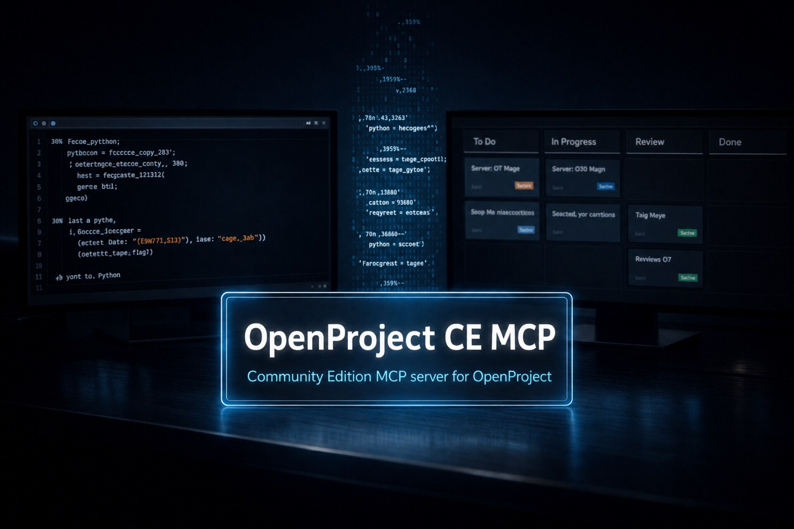

# OpenProject CE MCP

[](https://pypi.org/project/openproject-ce-mcp/)
[](https://www.python.org/downloads/)
[](LICENSE)
[](https://modelcontextprotocol.io)

<p align="center">
  
</p>

An MCP server for OpenProject that lets local AI agents read and manage project data through structured, guarded tools.

The server runs as a local subprocess of your MCP client over stdio. It wraps OpenProject API v3 and exposes typed tools for projects, work packages, memberships, versions, boards, time entries, and more.

---

## Scope: Community Edition

This MCP server targets **OpenProject Community Edition** only. It does not support Enterprise Edition features such as:

- Placeholder Users
- Budgets
- Portfolios
- Programs
- Custom Actions
- Baseline Comparisons

**Note:** OpenProject Enterprise Edition includes its own MCP server. If you have an Enterprise license, use the official Enterprise MCP instead of this one.

---

## Table of Contents

- [What you can do](#what-you-can-do)
- [How it works](#how-it-works)
- [Getting started](#getting-started)
- [Configuration](#configuration)
- [Tools](#tools)
- [Integrations](#integrations)
- [Architecture](#architecture)
- [Development](#development)

---

## What you can do

**Projects**
- List, create, copy, update, and delete projects
- Read project configurations, lifecycle phases, and admin context
- Create, update, and delete memberships and versions; list roles

**Work packages**
- List and search work packages with structured filters
- Create, update, and delete work packages; create subtasks; create, update, and delete relations; add comments (no edit or delete)
- Upload and delete attachments; add and remove watchers; read activity logs
- Log, update, and delete time entries

**Boards and views**
- Create, read, update, and delete saved boards (queries); read views

**Users and groups**
- Read user accounts and group memberships
- Create, update, lock, unlock, and delete users; add and remove group members

**Supporting data**
- Fetch individual wiki pages by id; create, update, and delete news; read and update documents
- Read and mark notifications; read help texts, working days, and instance configuration
- Create and inspect grids; inspect custom options

All write operations follow a preview-then-confirm pattern by default: call a tool once to get a validated preview, then again with `confirm=true` to execute. This can be bypassed globally with `OPENPROJECT_AUTO_CONFIRM_WRITE=true`.

Self-scoped mutations of the current user's own state — notification read state, preferences, and the current user's emoji reactions — execute directly without a preview step. Project-attached reactions still enforce project write scope.

---

## How it works

- Communicates with the MCP client over stdio — no remote server, no persistent storage
- Reads are enabled by default; writes require explicit opt-in via environment variables
- Create and update operations validate the payload against OpenProject form endpoints before writing; delete and other simple operations execute directly once confirmed
- Project scope is enforced server-side: the MCP only exposes what the configured allowlists permit
- Responses are bounded and paginated — compact summaries, not raw HAL payloads

### Context efficiency

A core reason to use this MCP instead of calling the OpenProject REST API directly:
it returns agent-shaped, context-frugal responses. The raw v3 API answers a list
request with full HAL payloads — every element carries ~21 top-level fields plus
~46 `_links`. The MCP returns a compact summary per row, drops derivable and
duplicated fields, and lets the agent request only the fields it needs.

Measured against the same three real work packages (token ≈ bytes/4):

| Response | Tokens | vs. raw API |
|---|---:|---:|
| Raw OpenProject REST API v3 (HAL) | ~10,500 | baseline |
| `list_work_packages` (MCP) | ~700 | **−93%** |
| `list_work_packages` with `select` (5 fields) | ~130 | **−98%** |

The tool set itself is trimmed too: on a fully write-enabled deployment the MCP's
`tools/list` payload dropped from ~60k to ~24k tokens (−60%) per request, mainly
by not emitting redundant output schemas. Rarely-used metadata tools are gated off
by default (`OPENPROJECT_ENABLE_METADATA_TOOLS`), and confirmed writes drop the
echoed request `payload`.

---

## Getting started

In short:

1. **Install the server** (the one-liner below).
2. **Copy the `command` and `env`** from the generated `.mcp.json` into your MCP
   client's config — or let the installer register a detected client for you.
3. **Restart your client.**
4. **Verify** by asking it to call `list_projects`.

The rest of this section covers each step in detail.

### Requirements

| | |
|---|---|
| Python | 3.10 or later |
| git | only for the "install from source" path (clones this repository) |
| OpenProject | Community Edition 16.1 or later (reviewed for compatibility through 17.5), API v3 accessible |
| OS | macOS 12+, Linux, or Windows 10/11 |

[`uv`](https://github.com/astral-sh/uv) is recommended for dependency management but not required.

### Prepare your OpenProject instance

An administrator must enable API token creation once:

**Administration → API and webhooks → API**

| Setting | Recommended |
|---|---|
| Enable API tokens | checked |
| Write access to read-only attributes | unchecked |
| Enable CORS | unchecked |

To create a personal token: **My account → Access tokens → + API token**. Copy the token immediately — it is only shown once. Format: `opapi-...`.

### Install

Install from PyPI, then run the interactive setup. Pick whichever installer you
already use:

```bash
# uv (recommended) — installs the openproject-ce-mcp command onto your PATH
uv tool install openproject-ce-mcp

# or pipx
pipx install openproject-ce-mcp

# or pip
pip install openproject-ce-mcp
```

Then configure it — this collects your OpenProject URL/token and permissions and
writes the config:

```bash
openproject-ce-mcp configure
```

It asks two independent questions:

1. **Configure globally (user-wide)?** — registers the server in a detected
   client's user-wide config (e.g. `~/.claude.json`), available in every project.
2. **Configure project-scoped (this directory)?** — writes config files into the
   current directory (`.mcp.json`, `.codex/config.toml`, `.vscode/mcp.json`,
   `.cursor/mcp.json`); offered for every supported client, whether or not it is
   detected. A generic `.mcp.json` you can copy values from is written too (unless
   you selected Claude Code, whose project config *is* `.mcp.json`).

Choose one or both; choosing neither aborts without writing anything (before it
even asks for your token). Existing entries for other MCP servers are kept and
each edited file is backed up first. After it writes, it tells you how to
(re)load each client so the server actually starts.

> **Zero-install run:** with `uv` you can skip installing entirely — point your
> client's `command` at `uvx` with args `["openproject-ce-mcp"]`. See the
> per-client guides below.

<details>
<summary><b>Alternative: install from source</b> (curl one-liner, needs git)</summary>

The source installer clones the repo, installs dependencies (via `uv` if
available, or `venv` + `pip` otherwise), and runs the same interactive setup.

**Windows (PowerShell)** — clones to `%USERPROFILE%\openproject-ce-mcp`, binary at `...\.venv\Scripts\openproject-ce-mcp.exe`; set `$env:DIR` to override the destination:

```powershell
irm https://raw.githubusercontent.com/jtauschl/openproject-ce-mcp/main/get.ps1 | iex
```

**macOS / Linux** — clones to `~/openproject-ce-mcp`, binary at `~/openproject-ce-mcp/.venv/bin/openproject-ce-mcp`; `DIR=…` overrides the destination:

```bash
curl -fsSL https://raw.githubusercontent.com/jtauschl/openproject-ce-mcp/main/get.sh | sh
```

</details>

PyPI/source installs use the same setup flow after installation: project
directories get a local `.mcp.json`; global setup registers a detected client
directly (see below).

### Register the server in your MCP client

Setup has two steps:

1. **Install the server once** — `uv tool install` / `pipx` / `pip` puts the
   `openproject-ce-mcp` command on your PATH (source installs build it in `.venv`),
   regardless of how many clients or projects you use.
2. **Register it per client** — each client needs its own config file pointing at
   that command. Registration only points your client to the installed command; it
   is not a second install. Using more than one client (say Claude *and* Codex)?
   Create one config file per client; they sit side by side.

**Which guide do I use?** Use VS Code → the GitHub Copilot guide. Use Claude Code
→ the Claude guide. Use the Claude desktop app → the Claude Desktop guide. Use
Cursor or Codex → their own guide. Any other MCP client → the generic note below.

The file, location, and format differ per client — you cannot copy one client's
config to another verbatim:

| Client | Project-scoped file | User-wide file | Format | Root key |
|---|---|---|---|---|
| Claude / Claude Code | `.mcp.json` | `~/.claude.json` | JSON | `mcpServers` |
| Claude Desktop app | — (global only) | `claude_desktop_config.json` | JSON | `mcpServers` |
| Codex | `.codex/config.toml` | `~/.codex/config.toml` | TOML | `[mcp_servers.openproject]` |
| Cursor | `.cursor/mcp.json` | `~/.cursor/mcp.json` | JSON | `mcpServers` |
| VS Code (GitHub Copilot) | `.vscode/mcp.json` | User `mcp.json` | JSON | `servers` |

> **VS Code users:** the Copilot guide below is your guide — VS Code runs MCP
> servers through GitHub Copilot in Agent mode.

**`openproject-ce-mcp configure` can write these files for you.** Before
collecting your settings it asks two independent questions:

- **Configure globally (user-wide)?** — adds the server to a detected client's
  user-wide config, available in every project.
- **Configure project-scoped (this directory)?** — writes config files into the
  current directory for every supported client (offered whether or not the client
  is detected), plus a generic `.mcp.json` you can copy from.

Choose one or both; choosing neither aborts without writing anything. Only the
`openproject` entry is written; existing entries for other MCP servers are kept
and each edited file is backed up first.

To register manually instead, copy the `command` and `env` values from the
generated `.mcp.json` into the file and format your client's guide shows — the
values are identical across clients.

Follow the guide for your client:

- [Claude / Claude Code](docs/claude.md)
- [Claude Desktop app](docs/claude-desktop.md)
- [Codex](docs/codex.md)
- [Cursor](docs/cursor.md)
- [VS Code / GitHub Copilot](docs/github.md)

**Any other MCP client** (Windsurf, JetBrains AI Assistant/Junie, Cline,
Continue, Warp, Zed, …) uses the same pattern: point `command` at the binary from
the generated `.mcp.json` and copy the `env` values. The root key is almost
always `mcpServers` (Zed uses `context_servers` with `"source": "custom"`;
Continue uses YAML with the same fields).

Each guide shows the project-scoped and/or user-wide config, how to reload the
client, and how to verify the server is picked up.

### Troubleshooting

| Symptom | Likely cause and fix |
|---|---|
| Server / tools don't appear | Client not restarted, or the config is in the wrong file. Reload the client and confirm the file, location, and root key match your client's row above. |
| `[auth_error]` on the first call | Wrong `OPENPROJECT_API_TOKEN` or `OPENPROJECT_BASE_URL`. Re-check both; the token is `opapi-…` and the base URL has no trailing `/api/v3`. |
| Tools appear but writes fail | Writes are opt-in. Enable the relevant `OPENPROJECT_ENABLE_*_WRITE` flag and make sure the project is in `OPENPROJECT_ALLOWED_PROJECTS_WRITE`. |

**Uninstall**

First unregister the server. This removes the `openproject` entry from your
clients' **user-wide** configs **and** from **project-local** configs in the
current directory (`.mcp.json`, `.codex/config.toml`, `.vscode/mcp.json`,
`.cursor/mcp.json`) — so run it from the project directory to clean that up too.
Your other MCP servers and settings are kept and each edited file is backed up
first; results are listed grouped by scope:

```bash
openproject-ce-mcp configure --uninstall   # or: openproject-ce-mcp-setup --uninstall
```

Then remove the package itself, matching how you installed it:

```bash
uv tool uninstall openproject-ce-mcp   # or: pipx uninstall openproject-ce-mcp
                                       # or: pip uninstall openproject-ce-mcp
```

<details>
<summary><b>Uninstalling a source install</b></summary>

If you installed from source, `uninstall.sh` / `uninstall.ps1` also remove the
local environment (`.venv`, caches, the API-source clones) in addition to
unregistering the client entries:

- **Windows:** `.\uninstall.ps1` (then remove the install dir if you want: `Remove-Item -Recurse -Force $env:USERPROFILE\openproject-ce-mcp`)
- **macOS / Linux:** `~/openproject-ce-mcp/uninstall.sh`

</details>

---

## Configuration

Your client config (`.mcp.json`, `.codex/config.toml`, or `.vscode/mcp.json`) contains your API token. Treat it like a password. This repo gitignores `.mcp.json`, but when you place a project-scoped config in your **own** project, add it to that project's `.gitignore` so the token is never committed.

Access is grouped into five chains: `project`, `membership`, `work_package`, `version`, and `board`. Each chain has a read flag and a write flag. Scoped flags control each chain independently.

| Variable | Required | Default | Description |
|---|---|---|---|
| `OPENPROJECT_BASE_URL` | yes | — | Base URL of your OpenProject instance, e.g. `https://op.example.com` |
| `OPENPROJECT_API_TOKEN` | yes | — | Personal API token |
| `OPENPROJECT_ALLOWED_PROJECTS_READ` | no | `*` | Readable projects; comma-separated identifiers, names, or glob patterns (e.g. `my-project,team-*`); `*` allows all visible projects |
| `OPENPROJECT_ALLOWED_PROJECTS_WRITE` | no | empty | Writable projects; empty disables all project-scoped writes; always intersected with read scope |
| `OPENPROJECT_ALLOWED_PROJECTS` | no | — | Backward-compatible alias for `OPENPROJECT_ALLOWED_PROJECTS_READ` |
| `OPENPROJECT_ENABLE_PROJECT_READ` | no | `true` | Projects, documents, news, wiki, lifecycle |
| `OPENPROJECT_ENABLE_WORK_PACKAGE_READ` | no | `true` | Work packages, relations, attachments, time entries |
| `OPENPROJECT_ENABLE_MEMBERSHIP_READ` | no | `true` | Memberships, roles, principals |
| `OPENPROJECT_ENABLE_VERSION_READ` | no | `true` | Versions |
| `OPENPROJECT_ENABLE_BOARD_READ` | no | `true` | Boards and views |
| `OPENPROJECT_HIDE_<ENTITY>_FIELDS` | no | empty | Comma-separated fields to omit from reads and reject on writes; `*` wildcards supported |
| `OPENPROJECT_HIDE_CUSTOM_FIELDS` | no | empty | Custom field names or keys to omit; `*` wildcards supported |
| `OPENPROJECT_ENABLE_ADMIN_WRITE` | no | `false` | User and group management (create/update/delete/lock users, create/update/delete groups). Must be set explicitly — not activated by any other write flag, and not prompted for by `openproject-ce-mcp configure`; edit `.mcp.json` by hand to enable it. |
| `OPENPROJECT_ENABLE_PROJECT_WRITE` | no | `false` | Project create/update/delete, news, documents, grids |
| `OPENPROJECT_ENABLE_MEMBERSHIP_WRITE` | no | `false` | Project membership create/update/delete |
| `OPENPROJECT_ENABLE_WORK_PACKAGE_WRITE` | no | `false` | Work-package create/update/delete, comments, relations, attachments, time entries |
| `OPENPROJECT_ENABLE_VERSION_WRITE` | no | `false` | Version create/update/delete |
| `OPENPROJECT_ENABLE_BOARD_WRITE` | no | `false` | Board create/update/delete |
| `OPENPROJECT_ENABLE_METADATA_TOOLS` | no | `false` | Expose the rarely-used metadata/reference tools (`get_query_*` schema tools, `render_text`, `get_custom_option`, `list_help_texts`/`get_help_text`, `list_working_days`/`list_non_working_days`). Off by default to keep them out of the tool set and save context; they stay reachable once enabled |
| `OPENPROJECT_AUTO_CONFIRM_WRITE` | no | `false` | Skip the preview step for all writes |
| `OPENPROJECT_AUTO_CONFIRM_DELETE` | no | inherits `OPENPROJECT_AUTO_CONFIRM_WRITE` | Skip the preview step for deletes |
| `OPENPROJECT_ATTACHMENT_ROOT` | no | current working directory | Directory that attachment uploads are confined to. Files outside it are refused, and credential/config files (`.mcp.json`, `.env`, `*.pem`, keys) are refused even inside it, so a tool call cannot exfiltrate local secrets |
| `OPENPROJECT_TIMEOUT` | no | `12` | Request timeout in seconds |
| `OPENPROJECT_VERIFY_SSL` | no | `true` | Verify TLS certificates |
| `OPENPROJECT_DEFAULT_PAGE_SIZE` | no | `10` | Default results per page (kept small to bound list context; raise if you want more rows per call) |
| `OPENPROJECT_MAX_PAGE_SIZE` | no | `50` | Hard cap on results per request |
| `OPENPROJECT_MAX_RESULTS` | no | `100` | Hard cap on total results returned by a tool |
| `OPENPROJECT_TEXT_LIMIT` | no | `500` | Char cap for the description preview in list/search results (context protection across many rows). Single-item reads (`get_work_package`, `get_work_package_activities`) return full text regardless; a per-call `text_limit` overrides this |
| `OPENPROJECT_LOG_LEVEL` | no | `WARNING` | `CRITICAL`, `ERROR`, `WARNING`, or `INFO` |

Supported entities for `OPENPROJECT_HIDE_<ENTITY>_FIELDS`: `project`, `membership`, `role`, `principal`, `user`, `group`, `project_access`, `project_admin_context`, `project_configuration`, `action`, `capability`, `job_status`, `project_phase_definition`, `project_phase`, `view`, `query_filter`, `query_column`, `query_operator`, `query_sort_by`, `query_filter_instance_schema`, `document`, `news`, `wiki_page`, `category`, `attachment`, `time_entry_activity`, `time_entry`, `work_package`, `relation`, `activity`, `reminder`, `version`, `board`, `current_user`, `instance_configuration`.

**Never share your API token** in chat messages, screenshots, or log output. If a token has been exposed, revoke it immediately in **My account → Access tokens** and create a new one.

---

## Tools

Tools are grouped by area: projects, memberships, users, groups, work packages, versions, boards, time entries, wiki, news, documents, notifications, grids, and more.

List and search tools accept a `select` parameter to return only the fields you
need per row, and responses are trimmed for context economy (list results drop
the derivable `count`/`truncated`; a confirmed write drops the echoed request
`payload`). A handful of rarely-used metadata tools are gated behind
`OPENPROJECT_ENABLE_METADATA_TOOLS` (see Configuration).

See the full [tool reference](docs/tools.md) for descriptions of every tool.

### Errors

Every tool failure carries a stable, machine-readable category as a leading
`[category]` prefix on the error message, so an agent can branch on the failure
type instead of parsing free text. The categories are:

| Category | Meaning |
|---|---|
| `[validation_error]` | An input was rejected before the request (fix the arguments and retry) |
| `[auth_error]` | Authentication failed (check the API token) |
| `[permission_denied]` | The token lacks permission, or a write scope is disabled |
| `[not_found]` | The resource does not exist (or the feature needs a newer OpenProject) |
| `[transport_error]` | OpenProject could not be reached (transient — safe to retry) |
| `[server_error]` | OpenProject returned an unexpected failure |
| `[openproject_error]` | Any other OpenProject-side failure |

Successful write previews are not errors — they return a structured result with
`ready`, `requires_confirmation`, `validation_errors`, and a human-readable
`message`.

---

## Integrations

The server communicates over stdio and is compatible with any MCP client. Client-specific setup guides are available in the [`docs/`](docs/) folder.

---

## Architecture

Five files, no deep abstractions:

- `config.py` — environment parsing and safe defaults
- `client.py` — HTTP access, policy checks, HAL normalization, preview/confirm writes
- `models.py` — compact dataclasses returned to MCP clients
- `tools.py` — validated MCP tool handlers
- `server.py` — FastMCP lifecycle wiring

`client.py` is intentionally large: all policy-sensitive logic (read gates, write gates, project scoping, field hiding) lives in one place to make it easier to audit.

See [docs/architecture.md](docs/architecture.md) for request flow details and the safety model.

---

## Development

### Set up

```bash
git clone https://github.com/jtauschl/openproject-ce-mcp.git
cd openproject-ce-mcp

# option A: uv (recommended)
uv sync --dev

# option B: venv + pip
python3 -m venv .venv
.venv/bin/pip install -e ".[dev]"
```

### Run tests

**Unit tests** (no network — run against `httpx` mocks):

```bash
# uv
uv run pytest

# venv
.venv/bin/python -m pytest
```

**Integration tests** (require a live OpenProject instance):

```bash
OPENPROJECT_BASE_URL=https://op.example.com \
OPENPROJECT_API_TOKEN=opapi-... \
OPENPROJECT_TEST_PROJECT=mcp-test \
uv run pytest -m integration -v
```

`OPENPROJECT_TEST_PROJECT` is the project identifier used for write tests (default: `mcp-test`). Integration tests are excluded from the default run (`-m 'not integration'`) and must be opted in explicitly.

For local, throwaway instances across the OpenProject versions where the API changed (16.6 classic + 17.4 displayId + 17.5 semantic/workspaces), see [`docker/test/`](docker/test/) — `docker/test/up.sh` boots and seeds them and prints the env block to run the integration tests against each. To verify the client's API assumptions against the OpenProject source across releases, see [`tools/api-check/`](tools/api-check/).

### After code changes

The MCP server runs as a subprocess. After any code change, restart your MCP client before updated tools become active.

### Releasing

The package is published to [PyPI](https://pypi.org/project/openproject-ce-mcp/)
via GitHub Actions using [trusted publishing](https://docs.pypi.org/trusted-publishers/)
(OIDC — no API token stored). Pushing a `vX.Y.Z` tag triggers `.github/workflows/publish.yml`,
which runs the test matrix, builds the sdist + wheel, and uploads them. Every
push and PR also runs the test matrix plus a `build` job (`uv build` +
`uvx twine check dist/*`) so the package always stays buildable.

To cut a release:

1. Bump `version` in `pyproject.toml` and update `CHANGELOG.md`.
2. `uv run pytest` and `uv build` locally (CI enforces both).
3. Merge to `main`, then tag: `git tag vX.Y.Z && git push origin vX.Y.Z`.
4. The `publish.yml` workflow builds and uploads to PyPI automatically.
   Create the GitHub release from the tag for release notes.

---
