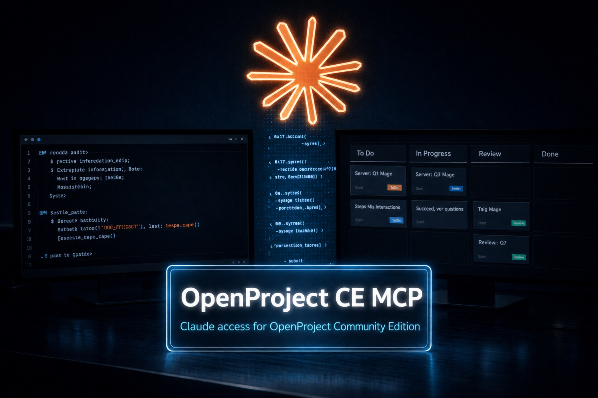

# Claude

<p align="center">
  
</p>

## Setup: Project-scoped (Preferred)

**Best practice:** Use `.mcp.json` in your project root. This allows different projects to have different OpenProject access and permissions.

### Steps

1. **Create `.mcp.json` in your project root.** From that directory, run the
   interactive setup to create it with your credentials:
   ```bash
   openproject-ce-mcp configure
   ```

2. **Or manually: Create `.mcp.json`**
   - Reference: [`.mcp.json.example`](../.mcp.json.example)
   - Protect it if it contains secrets: `chmod 600 .mcp.json`
   - **This file holds your API token.** Add `.mcp.json` to your project's `.gitignore` so it is never committed.

3. **Example config** — this mirrors what `openproject-ce-mcp configure` writes. With a PyPI install (uv tool / pipx / pip) the `command` is simply `openproject-ce-mcp` (resolved from your PATH); for a zero-install setup use `"command": "uvx"` with `"args": ["openproject-ce-mcp"]`. A source install instead points at the `.venv` binary (`...\.venv\bin\openproject-ce-mcp`, or `...\.venv\Scripts\openproject-ce-mcp.exe` on Windows).
   ```json
   {
     "mcpServers": {
       "openproject": {
         "command": "openproject-ce-mcp",
         "env": {
           "OPENPROJECT_BASE_URL": "https://op.example.com",
           "OPENPROJECT_API_TOKEN": "replace-with-your-token",

           "OPENPROJECT_ALLOWED_PROJECTS_READ": "my-project,other-project",
           "OPENPROJECT_ALLOWED_PROJECTS_WRITE": "my-project",

           "OPENPROJECT_ENABLE_PROJECT_READ": "true",
           "OPENPROJECT_ENABLE_MEMBERSHIP_READ": "true",
           "OPENPROJECT_ENABLE_WORK_PACKAGE_READ": "true",
           "OPENPROJECT_ENABLE_VERSION_READ": "true",
           "OPENPROJECT_ENABLE_BOARD_READ": "true",

           "OPENPROJECT_HIDE_PROJECT_FIELDS": "",
           "OPENPROJECT_HIDE_WORK_PACKAGE_FIELDS": "",
           "OPENPROJECT_HIDE_ACTIVITY_FIELDS": "",
           "OPENPROJECT_HIDE_CUSTOM_FIELDS": "",

           "OPENPROJECT_ENABLE_ADMIN_WRITE": "false",

           "OPENPROJECT_ENABLE_PROJECT_WRITE": "false",
           "OPENPROJECT_ENABLE_MEMBERSHIP_WRITE": "false",
           "OPENPROJECT_ENABLE_WORK_PACKAGE_WRITE": "false",
           "OPENPROJECT_ENABLE_VERSION_WRITE": "false",
           "OPENPROJECT_ENABLE_BOARD_WRITE": "false",
           "OPENPROJECT_ENABLE_METADATA_TOOLS": "false",

           "OPENPROJECT_TIMEOUT": "12",
           "OPENPROJECT_VERIFY_SSL": "true",
           "OPENPROJECT_DEFAULT_PAGE_SIZE": "10",
           "OPENPROJECT_MAX_PAGE_SIZE": "50",
           "OPENPROJECT_MAX_RESULTS": "100",
           "OPENPROJECT_TEXT_LIMIT": "500",
           "OPENPROJECT_LOG_LEVEL": "WARNING"
         }
       }
     }
   }
   ```

   Other keys (such as `OPENPROJECT_AUTO_CONFIRM_WRITE`) are optional and fall back to safe defaults when omitted — see the [Configuration table](../README.md#configuration) for the full list.

4. **Reload:** Restart Claude Code, or run "Developer: Reload Window" from the command palette (**Cmd+Shift+P** on macOS, **Ctrl+Shift+P** on Windows/Linux).

### Verify

After reloading, confirm the server is live:

- The `openproject` server appears in Claude Code's MCP server list (`/mcp`).
- Ask Claude to call `list_projects` (or `get_current_user`). A successful call returns your projects (or your account), which confirms the base URL and token work.
- If nothing appears, check that `command` is available on PATH (or is the absolute `.venv` path for a source install) and that `.mcp.json` is in the folder Claude Code opened as the project root.

---

## Setup: User-wide

**Alternative:** If you want to share one OpenProject CE MCP instance across all projects, use the user-wide config in your home directory.

- File:
  - **Windows:** `%USERPROFILE%\.claude.json`
  - **macOS:** `~/.claude.json`
  - **Linux:** `~/.claude.json`
- Security: `chmod 600 ~/.claude.json` on macOS/Linux; on Windows restrict it to your user via **Properties → Security**.

**Note:** All projects share the same credentials and permissions. Project-scoped setup (above) is the preferred method.

**Example:**
```json
{
  "mcpServers": {
    "openproject": {
      "command": "openproject-ce-mcp",
      "env": {
        "OPENPROJECT_BASE_URL": "https://op.example.com",
        "OPENPROJECT_API_TOKEN": "replace-with-your-token",

        "OPENPROJECT_ALLOWED_PROJECTS_READ": "*",
        "OPENPROJECT_ALLOWED_PROJECTS_WRITE": "",

        "OPENPROJECT_ENABLE_PROJECT_READ": "true",
        "OPENPROJECT_ENABLE_MEMBERSHIP_READ": "true",
        "OPENPROJECT_ENABLE_WORK_PACKAGE_READ": "true",
        "OPENPROJECT_ENABLE_VERSION_READ": "true",
        "OPENPROJECT_ENABLE_BOARD_READ": "true",

        "OPENPROJECT_HIDE_PROJECT_FIELDS": "",
        "OPENPROJECT_HIDE_WORK_PACKAGE_FIELDS": "",
        "OPENPROJECT_HIDE_ACTIVITY_FIELDS": "",
        "OPENPROJECT_HIDE_CUSTOM_FIELDS": "",

        "OPENPROJECT_ENABLE_ADMIN_WRITE": "false",

        "OPENPROJECT_ENABLE_PROJECT_WRITE": "false",
        "OPENPROJECT_ENABLE_MEMBERSHIP_WRITE": "false",
        "OPENPROJECT_ENABLE_WORK_PACKAGE_WRITE": "false",
        "OPENPROJECT_ENABLE_VERSION_WRITE": "false",
        "OPENPROJECT_ENABLE_BOARD_WRITE": "false",
        "OPENPROJECT_ENABLE_METADATA_TOOLS": "false",

        "OPENPROJECT_TIMEOUT": "12",
        "OPENPROJECT_VERIFY_SSL": "true",
        "OPENPROJECT_DEFAULT_PAGE_SIZE": "10",
        "OPENPROJECT_MAX_PAGE_SIZE": "50",
        "OPENPROJECT_MAX_RESULTS": "100",
        "OPENPROJECT_TEXT_LIMIT": "500",
        "OPENPROJECT_LOG_LEVEL": "WARNING"
      }
    }
  }
}
```

---

## Notes

- After changing the config, reload MCP servers: run "Developer: Reload Window" from the command palette (**Cmd+Shift+P** on macOS, **Ctrl+Shift+P** on Windows/Linux)
- `OPENPROJECT_ALLOWED_PROJECTS_READ` accepts comma-separated identifiers, names, or glob patterns: `project-one,team-*`. Use `*` for all visible projects
- `OPENPROJECT_ALLOWED_PROJECTS_WRITE` only narrows scope; it doesn't enable writes. Use the scoped `OPENPROJECT_ENABLE_*_WRITE` flags for the operations you need
