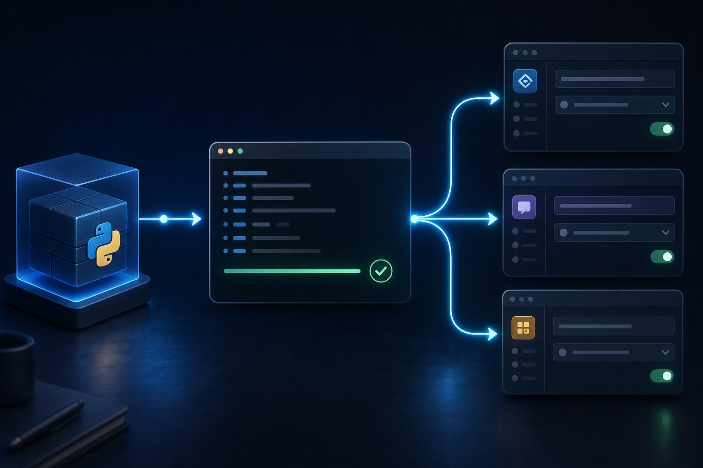

# Clients

  

`openproject-ce-mcp` communicates over stdio and works with any MCP client.
This page covers choosing a client guide, the global-vs-project-scoped
decision, and where each client's config file lives. For installing the
package itself, see [Installation](installation.md); for the full environment
variable reference, see [Configuration](configuration.md).

## Global vs. project-scoped

`openproject-ce-mcp configure` asks where to write the config before it asks
for credentials:

- **Project-scoped (this directory)** — writes config files into the current
  directory (`.mcp.json`, `.codex/config.toml`, `.vscode/mcp.json`,
  `.cursor/mcp.json`). Offered for every supported project-capable client
  (all except Claude Desktop, which is global-only), whether or not it is
  detected. **Recommended for most clients:** the server is then available
  only in the current project, so different projects can have different
  OpenProject access. VS Code/Copilot calls this "workspace-scoped" — same
  idea, different name. **Exception:** for Claude Code, prefer its native
  Local scope for credentials instead — see the note below.
- **Global (user-wide)** — registers the server in a detected client's
  user-wide config (e.g. `~/.claude.json`), available in every project.
  Choose this only if you intentionally want the same OpenProject server
  available everywhere.

Configure either scope in one run. Run `configure` again if you intentionally
want both scopes with separate settings. If a deselected scope already has an
OpenProject entry, setup asks whether to remove it; it never silently deletes
it. Existing entries for other MCP servers are kept, and each edited file is
backed up first.

This Project/Global choice describes what the `configure` wizard itself can
write — not necessarily every client's own scope terminology. Claude Code in
particular has a third, native **Local scope** (private and project-specific,
like Project scope, but stored outside your repository in `~/.claude.json`)
that Claude Code itself recommends for credentials. `configure` doesn't
produce it — it's set up manually via `claude mcp add`. See
[Claude / Claude Code](claude.md) for that command and the reasoning behind
it.

Codex supports `env_vars` forwarding, and the local Cursor IDE supports
`${env:...}` references for local STDIO servers — both keep the token out of
the MCP configuration file itself. See their guides' "Recommended setup"
sections for the manual patterns. `configure` still writes the token
literally for both, the same way it does for every other client.

Registration only points your client at the installed command; it is not a
second install. Using more than one client (say Claude and Codex)? Create one
config file per client; they sit side by side.

## Choosing a client guide

| If you use… | Guide |
|---|---|
| Claude Code (CLI + IDE extension) | [Claude / Claude Code](claude.md) |
| Claude Desktop app | [Claude Desktop app](claude-desktop.md) |
| Codex (CLI + IDE extension) | [Codex](codex.md) |
| Cursor | [Cursor](cursor.md) |
| VS Code with GitHub Copilot | [VS Code / GitHub Copilot](github.md) |
| Any other MCP client | see below |

**Any other MCP client** (Windsurf, JetBrains AI Assistant/Junie, Cline,
Continue, Warp, Zed, …) uses the same pattern: point `command` at the binary
from the generated `.mcp.json` and copy the `env` values. The root key is
almost always `mcpServers` (Zed uses `context_servers` with
`"source": "custom"`; Continue uses YAML with the same fields).

## File layout per client

The file, location, and format differ per client — you cannot copy one
client's config to another verbatim:

| Client | Project-scoped file | User-wide file | Format | Root key |
|---|---|---|---|---|
| Claude / Claude Code | `.mcp.json` | `~/.claude.json` | JSON | `mcpServers` |
| Claude Desktop app | — (global only) | `claude_desktop_config.json` | JSON | `mcpServers` |
| Codex | `.codex/config.toml` | `~/.codex/config.toml` | TOML | `[mcp_servers.openproject]` |
| Cursor | `.cursor/mcp.json` | `~/.cursor/mcp.json` | JSON | `mcpServers` |
| VS Code (GitHub Copilot) | `.vscode/mcp.json` | User `mcp.json` | JSON | `servers` |

`.mcp.json` *is* Claude Code's project config, so `configure` writes it once
and reuses it; for every other client chosen at project scope, `configure`
also writes a generic `.mcp.json` you can copy values from.

To register manually instead of running `configure`, copy the `command` and
`env` values from the generated `.mcp.json` into the file and format your
client's guide shows — the values are identical across clients (see
[`.mcp.json.example`](../.mcp.json.example) and
[Configuration](configuration.md) for the full set of `env` keys).

Each client guide shows the project-scoped and/or user-wide config, how to
protect the credential file, how to reload the client, and how to verify the
server is picked up.

## See also

- [Documentation hub](README.md) — full documentation index
- [Installation](installation.md) — install, update, and uninstall the package
- [Configuration](configuration.md) — wizard modes and the full environment variable reference
- [Troubleshooting](troubleshooting.md) — `doctor` diagnostics and common setup issues
