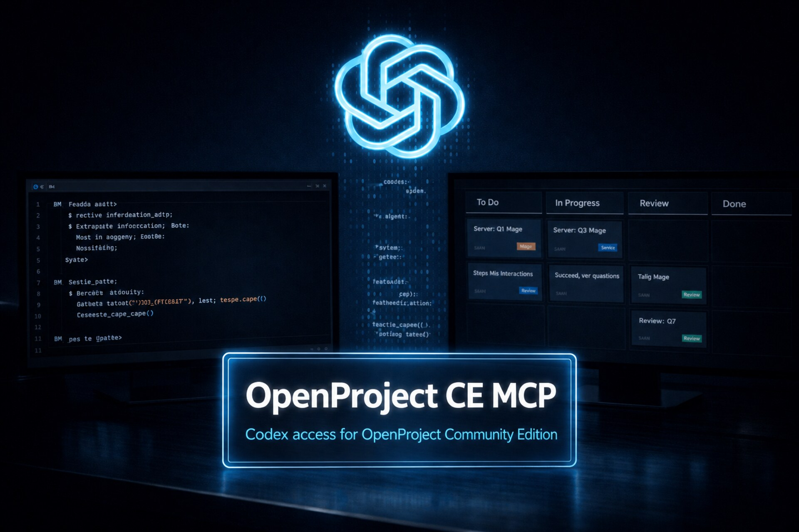

# Codex

<p align="center">
  
</p>

## Setup: Project-scoped (Preferred)

**Best practice:** Use `.codex/config.toml` in your project root. This allows different projects to have different OpenProject access and permissions.

**Note:** Codex loads project-scoped config files only when you trust the project.
You do not need the Codex CLI installed for this setup if you use the IDE extension and edit the config file directly.

### Steps

1. **Create `.codex/config.toml` in your project root**

2. **Protect it if it contains secrets:**
   ```bash
   chmod 600 .codex/config.toml
   ```
   **This file holds your API token.** Add `.codex/config.toml` to your project's `.gitignore` so it is never committed.

3. **Let the wizard write `.codex/config.toml` for you.** The easiest path is to run `openproject-ce-mcp configure`, answer the project-scoped gate, and select Codex — it writes `.codex/config.toml` for you. The example below (this TOML layout) is for creating it manually. With a PyPI install (uv tool / pipx / pip) the `command` is simply `openproject-ce-mcp` (resolved from your PATH); for a zero-install setup use `command = "uvx"` with `args = ["openproject-ce-mcp"]`. A source install instead points at the `.venv` binary (`...\.venv\bin\openproject-ce-mcp`, or `...\.venv\Scripts\openproject-ce-mcp.exe` on Windows).
   ```toml
   [mcp_servers.openproject]
   command = "openproject-ce-mcp"

   [mcp_servers.openproject.env]
   OPENPROJECT_BASE_URL = "https://op.example.com"
   OPENPROJECT_API_TOKEN = "replace-with-your-token"

   OPENPROJECT_ALLOWED_PROJECTS_READ = "my-project,other-project"
   OPENPROJECT_ALLOWED_PROJECTS_WRITE = "my-project"

   OPENPROJECT_ENABLE_PROJECT_READ = "true"
   OPENPROJECT_ENABLE_MEMBERSHIP_READ = "true"
   OPENPROJECT_ENABLE_WORK_PACKAGE_READ = "true"
   OPENPROJECT_ENABLE_VERSION_READ = "true"
   OPENPROJECT_ENABLE_BOARD_READ = "true"

   OPENPROJECT_HIDE_PROJECT_FIELDS = ""
   OPENPROJECT_HIDE_WORK_PACKAGE_FIELDS = ""
   OPENPROJECT_HIDE_ACTIVITY_FIELDS = ""
   OPENPROJECT_HIDE_CUSTOM_FIELDS = ""

   OPENPROJECT_ENABLE_ADMIN_WRITE = "false"

   OPENPROJECT_ENABLE_PROJECT_WRITE = "false"
   OPENPROJECT_ENABLE_MEMBERSHIP_WRITE = "false"
   OPENPROJECT_ENABLE_WORK_PACKAGE_WRITE = "false"
   OPENPROJECT_ENABLE_VERSION_WRITE = "false"
   OPENPROJECT_ENABLE_BOARD_WRITE = "false"

   OPENPROJECT_TIMEOUT = "12"
   OPENPROJECT_VERIFY_SSL = "true"
   OPENPROJECT_DEFAULT_PAGE_SIZE = "10"
   OPENPROJECT_MAX_PAGE_SIZE = "50"
   OPENPROJECT_MAX_RESULTS = "100"
   OPENPROJECT_TEXT_LIMIT = "500"
   OPENPROJECT_LOG_LEVEL = "WARNING"
   ```

   Other keys (such as `OPENPROJECT_AUTO_CONFIRM_WRITE`) are optional and fall back to safe defaults when omitted — see the [Configuration table](../README.md#configuration) for the full list.

4. **Verify in the IDE extension:**
   - trust the project
   - reload the editor window or restart Codex if needed
   - confirm the `openproject` server appears in Codex
   - confirm MCP tools are available in the session
   - ask Codex to call `list_projects` (or `get_current_user`); a successful reply confirms the base URL and token work

5. **Reload if needed:** If the server doesn't appear immediately in the IDE, restart Codex or reload the editor window

---

## Setup: User-wide

**Alternative:** If you want to share one OpenProject CE MCP instance across all projects, use the user-wide `config.toml`.

- File:
  - **Windows:** `%USERPROFILE%\.codex\config.toml`
  - **macOS:** `~/.codex/config.toml`
  - **Linux:** `~/.codex/config.toml`
- Security: `chmod 600 ~/.codex/config.toml` on macOS/Linux; on Windows restrict it to your user via **Properties → Security**.

**Note:** All projects share the same credentials and permissions. Project-scoped setup (above) is the preferred method.

**Example:** Use the same config as above in `~/.codex/config.toml`.

**CLI alternative (optional):** If you have the Codex CLI installed, you can add the server from the terminal instead. This writes to your shared Codex configuration:

```bash
codex mcp add openproject \
  --env OPENPROJECT_BASE_URL=https://op.example.com \
  --env OPENPROJECT_API_TOKEN=your-token \
  -- \
  openproject-ce-mcp
```

---

## Notes

- Codex supports user-level configuration in `~/.codex/config.toml` and project-scoped overrides in `.codex/config.toml`
- Codex loads project-scoped config files only for trusted projects
- Codex shares MCP configuration between the CLI and the IDE extension
- You do not need the Codex CLI when configuring Codex through the IDE extension
- Treat the CLI flow as optional helper functionality, not as the primary Codex setup path
- Project-scoped setup (`.codex/config.toml`) is preferred for fine-grained project permissions
- Protect `~/.codex/config.toml` if it contains secrets: `chmod 600 ~/.codex/config.toml`
- Protect `.codex/config.toml` if it contains secrets: `chmod 600 .codex/config.toml`
- `OPENPROJECT_ALLOWED_PROJECTS_READ` accepts comma-separated identifiers, names, or glob patterns: `project-one,team-*`. Use `*` for all visible projects
- `OPENPROJECT_ALLOWED_PROJECTS_WRITE` only narrows scope; it doesn't enable writes. Use the scoped `OPENPROJECT_ENABLE_*_WRITE` flags for the operations you need
- If you use `codex mcp add`, prefer `--env KEY=VALUE` for server variables. Plain shell `export`s are session-scoped and are not written into the saved MCP entry
