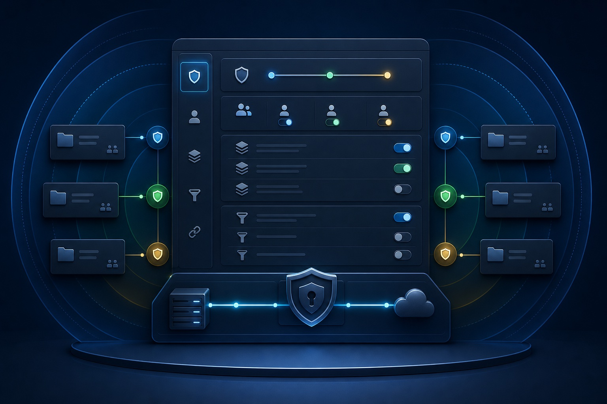

# Configuration

  

Your client config (`.mcp.json`, `.codex/config.toml`, or `.vscode/mcp.json`)
contains your API token. Treat it like a password. This repo gitignores
`.mcp.json`, but when you place a project-scoped config in your **own**
project, add it to that project's `.gitignore` so the token is never
committed — choose your client-specific guide from [Clients](clients.md) for
the exact file and command.

**Never share your API token** in chat messages, screenshots, or log output.
If a token has been exposed, revoke it immediately in **My account → Access
tokens** and create a new one.

## Wizard modes

`openproject-ce-mcp configure` writes a minimal config: only the values you
set differ from a safe default, so a fresh setup is just `OPENPROJECT_BASE_URL`
and `OPENPROJECT_API_TOKEN` plus whatever scope you gave it — not a
fully-spelled-out file (see the tables below for what every field defaults
to). Three flags control what it does; see [Clients](clients.md) for the
global-vs-project-scoped question every mode asks first:

- **`configure` / `configure --quick`** (the default) — client target(s), base
  URL, token, readable projects, and one *project-scoped* write-scope choice
  (`none` / `work-packages` / `all`, mapped to the five project-scoped
  `OPENPROJECT_ENABLE_*_WRITE` flags). This choice does not touch personal-data
  writes (`OPENPROJECT_ENABLE_PERSONAL_WRITE`) or admin writes
  (`OPENPROJECT_ENABLE_ADMIN_WRITE`) — those are independent and keep
  whatever value they already had (off, on a fresh setup). Use `--advanced`
  to change them.
- **`configure --advanced`** — the full questionnaire: detailed per-chain
  read/write groups, field filtering, individual write flags (including
  personal-data and admin writes), and runtime settings, in addition to the
  quick-mode questions. Reconfiguring an existing setup with `--quick` leaves
  any advanced-only values you'd previously set untouched.
- **`configure --uninstall`** — removes the `openproject` entry from client
  configs instead of writing one; see [Installation](installation.md#uninstall).

Before writing anything, the wizard tests the connection against your real
OpenProject instance and shows a preview of every change (files to create,
update, or remove; the effective settings) — nothing is written or removed
until you confirm. This is keyed on **stdin alone** being a real terminal, so
redirecting stdout (e.g. `configure | tee log`) does not skip it — a human
typing answers always gets the connection test and confirmation. Ctrl+C
cancels cleanly at any point without writing. Only a genuinely non-interactive
stdin (piped canned answers, CI, install scripts) or the explicit
`--non-interactive` flag skips the connection test and preview and writes
directly.

## Connection

| Variable | Required | Default | Description |
|---|---|---|---|
| `OPENPROJECT_BASE_URL` | yes | — | Base URL of your OpenProject instance, e.g. `https://op.example.com` |
| `OPENPROJECT_API_TOKEN` | yes | — | Personal API token |

## Project Scope

| Variable | Required | Default | Description |
|---|---|---|---|
| `OPENPROJECT_READ_PROJECTS` | no | empty (nothing readable) | Readable projects; comma-separated identifiers, names, or glob patterns (e.g. `my-project,team-*`); `*` allows all visible projects; empty or unset denies all project-scoped reads |
| `OPENPROJECT_WRITE_PROJECTS` | no | empty (nothing writable) | Writable projects; empty or unset disables all project-scoped writes; always intersected with read scope — so `*` here writes-enables every project that `OPENPROJECT_READ_PROJECTS` also allows, not every project on the instance regardless of read scope |

## Tool Groups

Each of the 8 tool groups below has its own `OPENPROJECT_ENABLE_<GROUP>_READ`
boolean controlling whether that group's tools are registered at all — this
governs tool *visibility* (and context-token budget), not data access; the
actual security boundary is `OPENPROJECT_READ_PROJECTS` /
`OPENPROJECT_WRITE_PROJECTS` plus the write flags below.

The 5 core groups default `true` (a fresh setup gets the full read surface for
them). `personal`, `extended`, and `admin` default `false` — they are opt-in
because they surface data with a different exposure profile than the core-5:
`personal` your own preferences/notifications, `extended` rarely-needed
metadata tools, and `admin` the instance-wide user/group list (names, logins,
emails) via `list_users`/`get_user`/`list_groups`/`get_group`/`list_principals`
— none of that is bounded by a project scope the way the core-5 are, so it
stays out of the tool set until explicitly requested.

| Variable | Required | Default | Description |
|---|---|---|---|
| `OPENPROJECT_ENABLE_PROJECT_READ` | no | `true` | Projects, favorites, admin/work-package context, phases |
| `OPENPROJECT_ENABLE_WORK_PACKAGE_READ` | no | `true` | Work packages, search, relations, attachments, watchers, reactions, sprints |
| `OPENPROJECT_ENABLE_MEMBERSHIP_READ` | no | `true` | Project memberships, roles, current user, actions, capabilities |
| `OPENPROJECT_ENABLE_VERSION_READ` | no | `true` | Versions |
| `OPENPROJECT_ENABLE_BOARD_READ` | no | `true` | Boards |
| `OPENPROJECT_ENABLE_PERSONAL_READ` | no | `false` | Your own preferences and notifications (`get_my_preferences`, `list_notifications`) |
| `OPENPROJECT_ENABLE_ADMIN_READ` | no | `false` | Instance-wide user/group listing (`list_users`, `get_user`, `list_groups`, `get_group`, `list_principals`) — PII (names, logins, emails), not project-scoped |
| `OPENPROJECT_ENABLE_EXTENDED_READ` | no | `false` | Rarely-used metadata/reference tools (`get_query_*` schema tools, `render_text`, `get_custom_option`, `list_help_texts`/`get_help_text`, `list_working_days`/`list_non_working_days`) |

Each write flag below requires its matching read boolean to be `true` — e.g.
`OPENPROJECT_ENABLE_BOARD_WRITE=true` with `OPENPROJECT_ENABLE_BOARD_READ=false`
fails at startup with a clear error. The 5 project-scoped write flags default
`true`, since the real gate for them is the project allowlists above (a write
flag alone does nothing without a project in `OPENPROJECT_WRITE_PROJECTS`, and
the corresponding write tools aren't even registered unless both
`OPENPROJECT_READ_PROJECTS` and `OPENPROJECT_WRITE_PROJECTS` are non-empty);
set one to `false` to carve out an exception once you've granted write access.
`OPENPROJECT_ENABLE_PERSONAL_WRITE` and `OPENPROJECT_ENABLE_ADMIN_WRITE` default
`false` — neither is bounded by a project allowlist, so there is no equivalent
safety net for them.

| Variable | Required | Default | Description |
|---|---|---|---|
| `OPENPROJECT_ENABLE_PROJECT_WRITE` | no | `true` | Project create/update/delete, news, documents, grids. has no effect without a non-empty `OPENPROJECT_WRITE_PROJECTS` |
| `OPENPROJECT_ENABLE_WORK_PACKAGE_WRITE` | no | `true` | Work-package create/update/delete, comments, relations, attachments, time entries. has no effect without a non-empty `OPENPROJECT_WRITE_PROJECTS` |
| `OPENPROJECT_ENABLE_MEMBERSHIP_WRITE` | no | `true` | Project membership create/update/delete. has no effect without a non-empty `OPENPROJECT_WRITE_PROJECTS` |
| `OPENPROJECT_ENABLE_VERSION_WRITE` | no | `true` | Version create/update/delete. has no effect without a non-empty `OPENPROJECT_WRITE_PROJECTS` |
| `OPENPROJECT_ENABLE_BOARD_WRITE` | no | `true` | Board create/update/delete. has no effect without a non-empty `OPENPROJECT_WRITE_PROJECTS` |
| `OPENPROJECT_ENABLE_PERSONAL_WRITE` | no | `false` | Personal-data mutations (update your own preferences, mark notifications read). Requires `OPENPROJECT_ENABLE_PERSONAL_READ=true`; unlike the other write flags, `personal` also gates the paired reads, so both must be true together for these tools to appear |

`OPENPROJECT_ENABLE_ADMIN_WRITE` is documented under
[Security / Privacy](#security--privacy) below.

### Exposure controls vs. real security boundaries

`OPENPROJECT_ENABLE_*_WRITE`, the project scope
(`OPENPROJECT_READ_PROJECTS`/`OPENPROJECT_WRITE_PROJECTS`), field hiding, and
the preview/confirm flow are real security boundaries when the agent talks to
OpenProject exclusively through this MCP's tools: they stop an agent's own
mistakes and prompt-injection attempts from turning into writes or reads the
operator didn't intend.

`OPENPROJECT_ENABLE_PERSONAL_READ`/`_EXTENDED_READ`/`_ADMIN_READ` are also
runtime-enforced gates, not cosmetic toggles — they genuinely control what
data reaches the agent's context, `_ADMIN_READ` in particular keeping the
instance-wide user/group list (PII) out of context by default. What none of
these controls can do is stop someone who independently holds the API token
and network access to OpenProject — they can call the REST API directly,
bypassing this MCP entirely. That is the OpenProject role/permission system's
job, not this server's: combine both layers for real defense in depth.

## Token / Context Budget

| Variable | Required | Default | Description |
|---|---|---|---|
| `OPENPROJECT_DEFAULT_PAGE_SIZE` | no | `10` | Default results per page (kept small to bound list context; raise if you want more rows per call). Must not exceed `OPENPROJECT_MAX_PAGE_SIZE` |
| `OPENPROJECT_MAX_PAGE_SIZE` | no | `50` | Hard cap on results per request. Must not exceed `OPENPROJECT_MAX_RESULTS` |
| `OPENPROJECT_MAX_RESULTS` | no | `100` | Hard cap on total results returned by a tool |
| `OPENPROJECT_TEXT_LIMIT` | no | `500` | Char cap for the description preview in list/search results (context protection across many rows), max `50000`. Single-item reads (`get_work_package`, `get_work_package_activities`) return full text regardless; a per-call `text_limit` overrides this |

## Security / Privacy

| Variable | Required | Default | Description |
|---|---|---|---|
| `OPENPROJECT_HIDE_<ENTITY>_FIELDS` | no | empty | Comma-separated fields to omit from reads and reject on writes for a given entity; `*` wildcards supported. See [Field hiding](field-hiding.md) for the full list of supported entities and the matching syntax — this variable exists once per entity, so it is not repeated here in full |
| `OPENPROJECT_HIDE_CUSTOM_FIELDS` | no | empty | Custom field names or keys to omit; `*` wildcards supported |
| `OPENPROJECT_ATTACHMENT_ROOT` | no | disabled (no uploads) | Absolute directory that local attachment uploads are confined to. Unset/empty disables `create_work_package_attachment` entirely — there is no current-working-directory fallback. Files outside the configured root are refused, and credential/config files (`.mcp.json`, `.env`, `*.pem`, keys) are refused even inside it, so a tool call cannot exfiltrate local secrets |
| `OPENPROJECT_ENABLE_ADMIN_WRITE` | no | `false` | User and group management (create/update/delete/lock users, create/update/delete groups). Must be set explicitly and is not activated by any project-scoped write flag |

## Network / Runtime

| Variable | Required | Default | Description |
|---|---|---|---|
| `OPENPROJECT_TIMEOUT` | no | `12` | Request timeout in seconds |
| `OPENPROJECT_VERIFY_SSL` | no | `true` | Verify TLS certificates |
| `OPENPROJECT_MAX_RETRIES` | no | `3` | Retries for 429/5xx responses, max `10` |
| `OPENPROJECT_RETRY_BASE_DELAY` | no | `1.0` | Initial retry delay in seconds |
| `OPENPROJECT_RETRY_MAX_DELAY` | no | `60.0` | Maximum retry delay in seconds; must be ≥ `OPENPROJECT_RETRY_BASE_DELAY` |
| `OPENPROJECT_LOG_LEVEL` | no | `WARNING` | `CRITICAL`, `ERROR`, `WARNING`, or `INFO` |

Invalid combinations (e.g. `MAX_RETRIES` above 10, `DEFAULT_PAGE_SIZE` above
`MAX_PAGE_SIZE`) fail at startup with a clear error rather than being silently
clamped.

## Legacy configuration migration

At runtime, these older variable names are detected but never used to
configure the server — setting one has no effect beyond a one-time
startup/`doctor` warning naming its replacement. The setup wizard
additionally preserves legacy project-allowlist values, as described below.
Rename to the current variable for the setting to actually take effect at
runtime:

| Legacy variable | Replaced by |
|---|---|
| `OPENPROJECT_ALLOWED_PROJECTS` | `OPENPROJECT_READ_PROJECTS` |
| `OPENPROJECT_ALLOWED_PROJECTS_READ` | `OPENPROJECT_READ_PROJECTS` |
| `OPENPROJECT_ALLOWED_PROJECTS_WRITE` | `OPENPROJECT_WRITE_PROJECTS` |
| `OPENPROJECT_ENABLE_METADATA_TOOLS` | `OPENPROJECT_ENABLE_EXTENDED_READ` |
| `OPENPROJECT_TOOLS` | the individual `OPENPROJECT_ENABLE_<GROUP>_READ` variables above |
| `OPENPROJECT_PERSONAL_WRITE` | `OPENPROJECT_ENABLE_PERSONAL_WRITE` |

`openproject-ce-mcp configure` preserves the legacy project-allowlist
variables' values (`OPENPROJECT_ALLOWED_PROJECTS`/`_READ`/`_WRITE`) when
rewriting an existing configuration, prefilling `OPENPROJECT_READ_PROJECTS`/
`OPENPROJECT_WRITE_PROJECTS` from them. The other legacy variables in this
table are warned about but ignored — rename them manually before running the
wizard if you want to keep their setting. This table is only relevant if you
edit a config file by hand.

## See also

- [Documentation hub](README.md) — full documentation index
- [Installation](installation.md) — install, update, and uninstall the package
- [Clients](clients.md) — which client to register with and where its config lives
- [Field hiding](field-hiding.md) — full list of entities supported by `OPENPROJECT_HIDE_<ENTITY>_FIELDS`
- [Troubleshooting](troubleshooting.md) — `doctor` diagnostics and common setup issues
