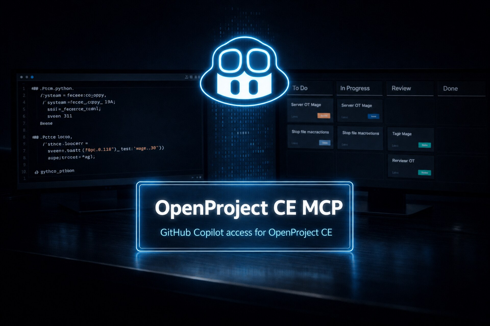

# VS Code (GitHub Copilot)

<p align="center">
  
</p>

This guide covers **VS Code**, where MCP servers run through **GitHub Copilot in
Agent mode**. If you use VS Code, this is your guide.

> **Note on setup output:** The `openproject-ce-mcp configure` wizard can
> configure VS Code directly — answer the project-scoped gate and choose VS
> Code (or pick the global option) and it writes `.vscode/mcp.json` with the
> correct `servers` block and `"type": "stdio"`. If you prefer to edit the file
> yourself, the manual steps below copy the `command` path and `env` values into
> `.vscode/mcp.json` (a `servers` block with `"type": "stdio"`).

## Setup: Workspace-scoped (Preferred)

**Best practice:** Use `.vscode/mcp.json` in your workspace. This allows different workspaces to have different OpenProject access and permissions.

### Steps

1. **Let the wizard write `.vscode/mcp.json` for you.** The easiest path is to run
   `openproject-ce-mcp configure`, answer the project-scoped gate, and select VS
   Code — it writes `.vscode/mcp.json` (with the `servers` block and
   `"type": "stdio"`) for you. The example below shows the format if you prefer to
   create it manually.

2. **Protect it if it contains secrets:**
   ```bash
   chmod 600 .vscode/mcp.json
   ```
   **This file holds your API token.** Add `.vscode/mcp.json` to your project's `.gitignore` so it is never committed.

3. **Example config:** With a PyPI install the command is simply `openproject-ce-mcp`; source installs can use the `.venv` binary path (`...\.venv\Scripts\openproject-ce-mcp.exe` on Windows).
   ```json
   {
     "servers": {
       "openproject": {
         "type": "stdio",
         "command": "openproject-ce-mcp",
         "env": {
           "OPENPROJECT_BASE_URL": "https://op.example.com",
           "OPENPROJECT_API_TOKEN": "replace-with-your-token",

           "OPENPROJECT_ALLOWED_PROJECTS_READ": "my-project,other-project",
           "OPENPROJECT_ALLOWED_PROJECTS_WRITE": "my-project",

           "OPENPROJECT_ENABLE_PROJECT_READ": "true",
           "OPENPROJECT_ENABLE_MEMBERSHIP_READ": "true",
           "OPENPROJECT_ENABLE_WORK_PACKAGE_READ": "true",
           "OPENPROJECT_ENABLE_VERSION_READ": "true",
           "OPENPROJECT_ENABLE_BOARD_READ": "true",

           "OPENPROJECT_HIDE_PROJECT_FIELDS": "",
           "OPENPROJECT_HIDE_WORK_PACKAGE_FIELDS": "",
           "OPENPROJECT_HIDE_ACTIVITY_FIELDS": "",
           "OPENPROJECT_HIDE_CUSTOM_FIELDS": "",

           "OPENPROJECT_ENABLE_ADMIN_WRITE": "false",

           "OPENPROJECT_ENABLE_PROJECT_WRITE": "false",
           "OPENPROJECT_ENABLE_MEMBERSHIP_WRITE": "false",
           "OPENPROJECT_ENABLE_WORK_PACKAGE_WRITE": "false",
           "OPENPROJECT_ENABLE_VERSION_WRITE": "false",
           "OPENPROJECT_ENABLE_BOARD_WRITE": "false",

           "OPENPROJECT_TIMEOUT": "12",
           "OPENPROJECT_VERIFY_SSL": "true",
           "OPENPROJECT_DEFAULT_PAGE_SIZE": "10",
           "OPENPROJECT_MAX_PAGE_SIZE": "50",
           "OPENPROJECT_MAX_RESULTS": "100",
           "OPENPROJECT_TEXT_LIMIT": "500",
           "OPENPROJECT_LOG_LEVEL": "WARNING"
         }
       }
     }
   }
   ```

   Other keys (such as `OPENPROJECT_AUTO_CONFIRM_WRITE`) are optional and fall back to safe defaults when omitted — see the [Configuration table](../README.md#configuration) for the full list.

4. **Reload:** Open the command palette (**Cmd+Shift+P** on macOS, **Ctrl+Shift+P** on Windows/Linux) and run "Developer: Reload Window".

### Verify

- Switch Copilot Chat to **Agent mode** (MCP tools are only available there).
- Open the tool picker in Copilot Chat and confirm the `openproject` tools are listed.
- Ask Copilot to call `list_projects` (or `get_current_user`). A successful reply confirms the base URL and token work.
- If the server doesn't appear, re-check that the file is `.vscode/mcp.json` with a `servers` block and `"type": "stdio"`, and that `command` is available on PATH (or is the absolute `.venv` path for a source install).

---

## Setup: User-wide

**Alternative:** Use the user `mcp.json` if you want the server available in all workspaces.

1. Open the command palette (**Cmd+Shift+P** on macOS, **Ctrl+Shift+P** on Windows/Linux) and select "Open User MCP Settings"
2. **Add the same config** as above (workspace-scoped example)
3. **Reload:** Open the command palette again and run "Developer: Reload Window"

If you prefer to edit the file directly, the user `mcp.json` lives at:

- **Windows:** `%APPDATA%\Code\User\mcp.json`
- **macOS:** `~/Library/Application Support/Code/User/mcp.json`
- **Linux:** `~/.config/Code/User/mcp.json`

**Note:** All workspaces share the same credentials and permissions. Workspace-scoped setup (above) is the preferred method.

---

## Notes

- Switch Copilot Chat to Agent mode so MCP tools are available
- Workspace-scoped setup (`.vscode/mcp.json`) is preferred for fine-grained project permissions
- Avoid hardcoding sensitive information when possible. VS Code recommends using environment files or input variables
- After changing the config, reload: open the command palette (**Cmd+Shift+P** on macOS, **Ctrl+Shift+P** on Windows/Linux) → "Developer: Reload Window"
- `OPENPROJECT_ALLOWED_PROJECTS_READ` accepts comma-separated identifiers, names, or glob patterns: `project-one,team-*`. Use `*` for all visible projects
- `OPENPROJECT_ALLOWED_PROJECTS_WRITE` only narrows scope; it doesn't enable writes. Use the scoped `OPENPROJECT_ENABLE_*_WRITE` flags for the operations you need
